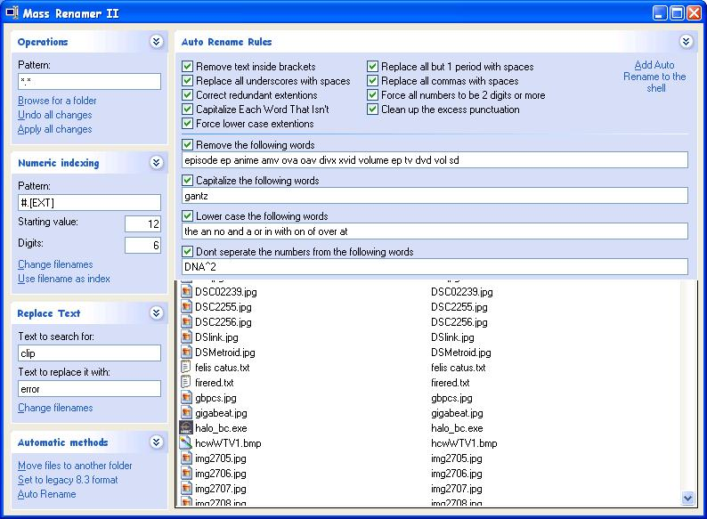



## Mass File Renamer II

### Description

Allows you to rename files en masse with some preset patterns. Added the ability to use the modification date in the numeric indexing pattern. (Press '?' for details) Replaced the browse for folder method with the control in http://ccrp.mvps.org/download/controls/ccrpftv6-10.zip

Can now use the old filename in the numeric indexing pattern. I did have it in MR1 but thought no one used it.

Fixed a critical error
 
### More Info
 

             |
---                |---
**Submitted On**   |2004-10-11 16:31:20
**By**             |[Techni Rei Myoko](https://github.com/Planet-Source-Code/PSCIndex/blob/master/ByAuthor/techni-rei-myoko.md)
**Level**          |Advanced
**User Rating**    |4.7 (14 globes from 3 users)
**Compatibility**  |VB 6\.0
**Category**       |[Files/ File Controls/ Input/ Output](https://github.com/Planet-Source-Code/PSCIndex/blob/master/ByCategory/files-file-controls-input-output__1-3.md)
**World**          |[Visual Basic](https://github.com/Planet-Source-Code/PSCIndex/blob/master/ByWorld/visual-basic.md)
**Archive File**   |[Mass\_File\_18040810112004\.zip](https://github.com/Planet-Source-Code/techni-rei-myoko-mass-file-renamer-ii__1-56550/archive/master.zip)

